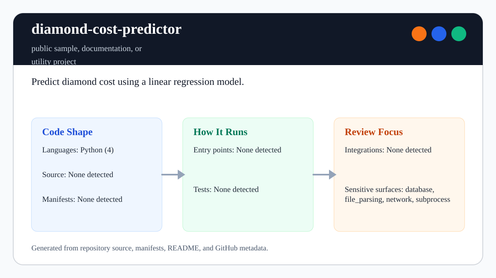

# diamond-cost-predictor

<!-- README-OVERVIEW-IMAGE -->


## Overview

`garethpaul/diamond-cost-predictor` is a public sample, documentation, or utility project. Predict diamond cost using a linear regression model.

This README is based on the checked-in source, manifests, scripts, and repository metadata on the `master` branch. The project language mix found during review was: Python (12), shell (2).

## Repository Contents

- `CHANGES.md` - maintenance history
- `SECURITY.md` - security reporting and disclosure guidance
- `VISION.md` - project direction and maintenance guardrails
- `csv.py` - converts scraped diamond record literals into numeric CSV rows
- `Makefile` - repository-level verification wrapper
- `scripts/check-baseline.sh` - source-level safe parsing guard

Additional scan context:

- Source directories: scripts
- Dependency and build manifests: none detected
- Entry points or build surfaces: `csv.py`, `Makefile`, `scripts/check-baseline.sh`
- Test-looking files: no obvious test files detected

## Getting Started

### Prerequisites

- Git
- Python 3.12 or newer for parser, scraper, and source baseline checks
- R and rpy2 for the modeling/graph scripts when regenerating model outputs

### Setup

```bash
git clone https://github.com/garethpaul/diamond-cost-predictor.git
cd diamond-cost-predictor
```

The setup commands above are derived from repository files. Legacy mobile, Python, or JavaScript samples may require older SDKs or package versions than a modern workstation uses by default.

## Running or Using the Project

Convert scraped `diamonds.txt` records to numeric CSV rows with:

```bash
python3 csv.py diamonds.txt > output.csv
```

Download a bounded PriceScope carat range with HTTPS and an explicit timeout:

```bash
python3 psdownload.py 0.25 0.30 --output diamonds.txt --timeout 15
```

The downloader defaults to `https://www.pricescope.com/results/ajax/` and rejects
non-HTTPS endpoint overrides. Use `--endpoint` or `PRICESCOPE_AJAX_URL` only for
HTTPS-compatible test endpoints.
Scraper arguments reject non-positive carat values, ranges where `max_carat` is
not greater than `min_carat`, and non-positive download timeouts before making
requests.

The modeling scripts still depend on R/rpy2. Keep runtime changes scoped and
document the exact Python/R environment used when updating that path.

## Testing and Verification

Run the safe parsing baseline before committing parser or data-shape changes:

```bash
make check
scripts/check-baseline.sh
```

`make check` runs the source baseline and focused parser/scraper tests from the
repository root. The guard compiles the Python scripts, runs parser and scraper
helper regression tests, verifies that scraped diamond records are parsed with
`ast.literal_eval` instead of `eval`, and checks that scraper downloads use
HTTPS with a timeout. Parser tests also reject non-finite or non-positive
numeric model inputs, so generated CSV rows contain finite positive numeric
values for carat, depth, table, vendor ID, and price.

When the required SDK or runtime is unavailable, use static checks and source review first, then verify on a machine that has the matching platform toolchain.

## Configuration and Secrets

- No required secret or credential file was identified in the repository scan. If you add integrations later, keep secrets out of git.

## Security and Privacy Notes

- `csv.py` parses downloaded records with `ast.literal_eval` and rejects unsafe
  non-literal input.
- Numeric parser validation rejects non-finite or non-positive model inputs
  before they are written to generated CSV rows.
- `psdownload.py` defaults to HTTPS, rejects non-HTTPS endpoint overrides, and
  handles page-level timeout or URL errors.
- `psdownload.py` validates carat ranges and timeout values before scraping.
- Review changes touching network requests, downloaded data, model formulas, or
  generated datasets carefully.

## Maintenance Notes

- See `SECURITY.md` for vulnerability reporting and safe research guidance.
- See `VISION.md` for project direction and contribution guardrails.
- See `CHANGES.md` for maintenance history.
- See `docs/plans/2026-06-08-pricescope-https-baseline.md` for the HTTPS
  downloader hardening follow-up.
- `diamonds.txt` and `prediction.pdf` are generated artifacts and are ignored by
  default.

## Contributing

Keep changes small and tied to the project that is already present in this repository. For code changes, document the toolchain used, avoid committing generated dependency directories or local configuration, and update this README when setup or verification steps change.
